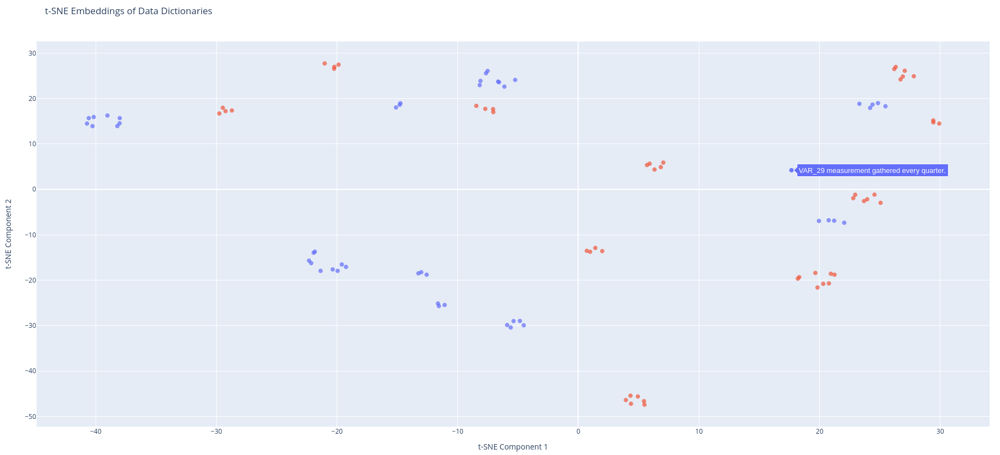

# datastew

 

Datastew is a python library for intelligent data harmonization using Large Language Model (LLM) vector embeddings.

## Installation

```bash
pip install datastew
```

## Usage

### Harmonizing excel/csv resources

You can directly import common data models, terminology sources or data dictionaries for harmonization directly from a
csv, tsv or excel file. An example how to match two separate variable descriptions is shown in
[datastew/scripts/mapping_excel_example.py](datastew/scripts/mapping_excel_example.py):

```python
from datastew.process.parsing import DataDictionarySource
from datastew.process.mapping import map_dictionary_to_dictionary

# Variable and description refer to the corresponding column names in your excel sheet
source = DataDictionarySource("source.xlxs", variable_field="var", description_field="desc")
target = DataDictionarySource("target.xlxs", variable_field="var", description_field="desc")

df = map_dictionary_to_dictionary(source, target)
df.to_excel("result.xlxs")
```

The resulting file contains the pairwise variable mapping based on the closest similarity for all possible matches
as well as a similarity measure per row.

Per default this will use the local MPNet model, which may not yield the optimal performance. If you got an OpenAI API
key it is possible to use their embedding API instead. To use your key, create an OpenAIAdapter model and pass it to the
function:

```python
from datastew.embedding import GPT4Adapter

embedding_model = GPT4Adapter(key="your_api_key")
df = map_dictionary_to_dictionary(source, target, embedding_model=embedding_model)
```

---

### Creating and using stored mappings

A simple example how to initialize an in memory database and compute a similarity mapping is shown in
[datastew/scripts/mapping_db_example.py](datastew/scripts/mapping_db_example.py):

1) Initialize the repository and embedding model:

```python
from datastew.repository import WeaviateRepository
from datastew.repository.model import Terminology, Concept, Mapping
from datastew.embedding import MPNetAdapter

repository = WeaviateRepository(mode='disk', path='localhost', port=8080)
embedding_model = MPNetAdapter()
# embedding_model = GPT4Adapter(key="your_key") # Use this line for higher accuracy if you have an OpenAI API key
```


2) Create a baseline of data to map to in the initialized repository. Text gets attached to any unique concept of an
existing or custom vocabulary or terminology namespace in the form of a mapping object containing the text, embedding,
and the name of sentence embedder used. Multiple Mapping objects with textually different but semantically equal
descriptions can point to the same Concept.

```python
terminology = Terminology("snomed CT", "SNOMED")

text1 = "Diabetes mellitus (disorder)"
concept1 = Concept(terminology, text1, "Concept ID: 11893007")
mapping1 = Mapping(concept1, text1, embedding_model.get_embedding(text1), embedding_model.get_model_name())

text2 = "Hypertension (disorder)"
concept2 = Concept(terminology, text2, "Concept ID: 73211009")
mapping2 = Mapping(concept2, text2, embedding_model.get_embedding(text2), embedding_model.get_model_name())

repository.store_all([terminology, concept1, mapping1, concept2, mapping2])
```

3) Retrieve the closest mappings and their similarities for a given text:

```python
text_to_map = "Sugar sickness" # Semantically similar to "Diabetes mellitus (disorder)"
embedding = embedding_model.get_embedding(text_to_map)

results = repository.get_closest_mappings_with_similarities(embedding, limit=2)

for result in results:
    print(result)
```

output:

```python
snomed CT > Concept ID: 11893007 : Diabetes mellitus (disorder) | Diabetes mellitus (disorder) | Similarity: 0.4735338091850281
snomed CT > Concept ID: 73211009 : Hypertension (disorder) | Hypertension (disorder) | Similarity: 0.2003161907196045
```

You can also import data from file sources (csv, tsv, xlsx) or from a public API like OLS. An example script to
download & compute embeddings for SNOMED from ebi OLS can be found in
[datastew/scripts/ols_snomed_retrieval.py](datastew/scripts/ols_snomed_retrieval.py).

---

### Embedding visualization

You can visualize the embedding space of multiple data dictionary sources with t-SNE plots utilizing different
language models. An example how to generate a t-sne plot is shown in
[datastew/scripts/tsne_visualization.py](datastew/scripts/tsne_visualization.py):

```python
from datastew.embedding import MPNetAdapter
from datastew.process.parsing import DataDictionarySource
from datastew.visualisation import plot_embeddings

# Variable and description refer to the corresponding column names in your excel sheet
data_dictionary_source_1 = DataDictionarySource(
    "source1.xlsx", variable_field="var", description_field="desc"
)
data_dictionary_source_2 = DataDictionarySource(
    "source2.xlsx", variable_field="var", description_field="desc"
)

mpnet_adapter = MPNetAdapter()
plot_embeddings(
    [data_dictionary_source_1, data_dictionary_source_2], embedding_model=mpnet_adapter
)
```

